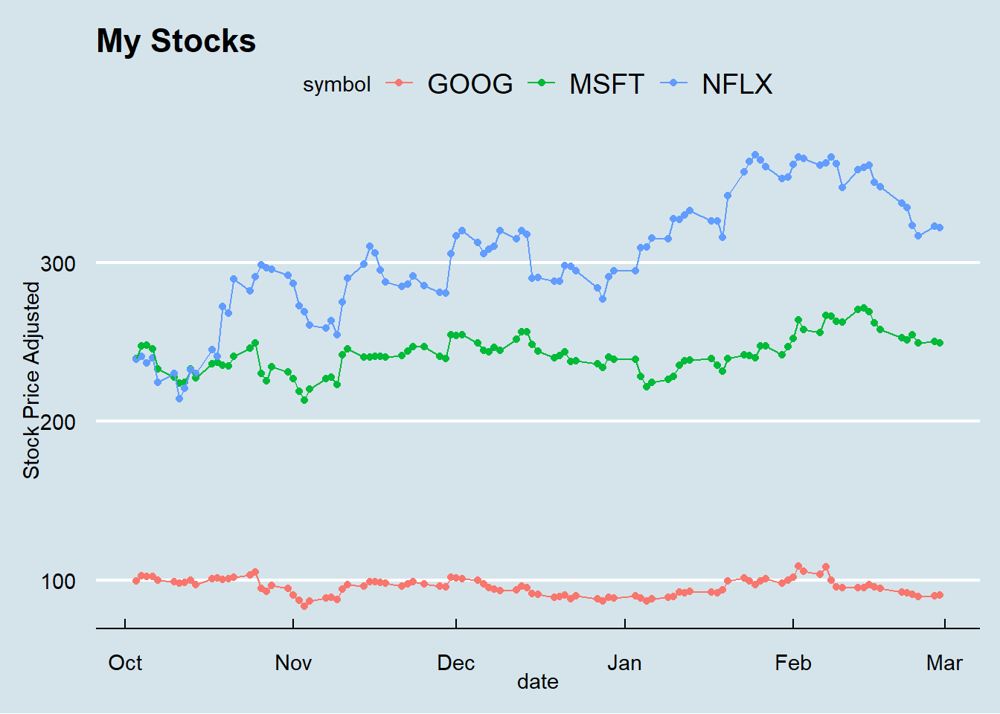
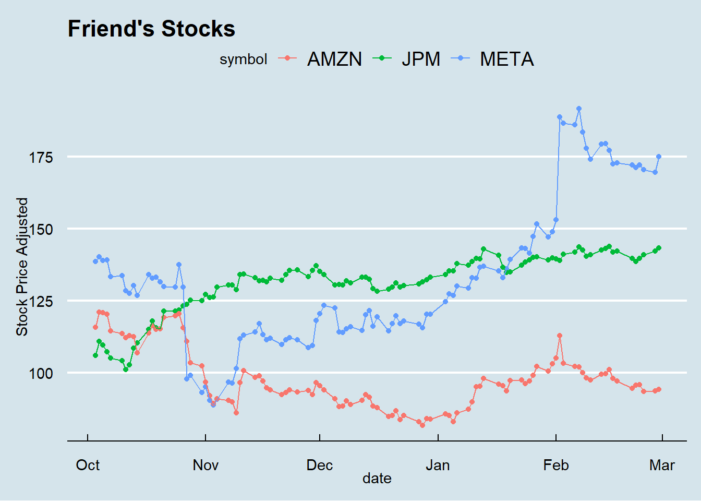
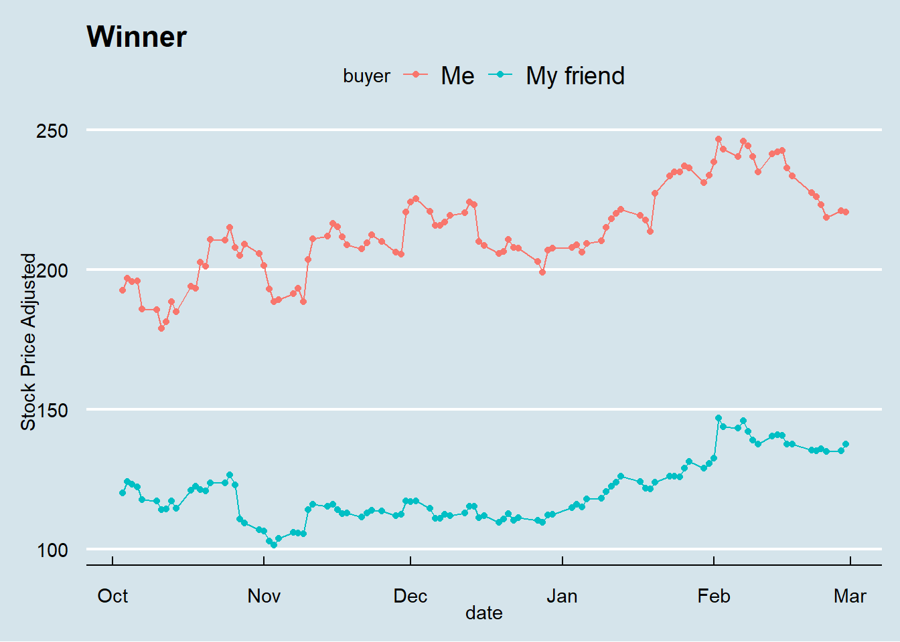
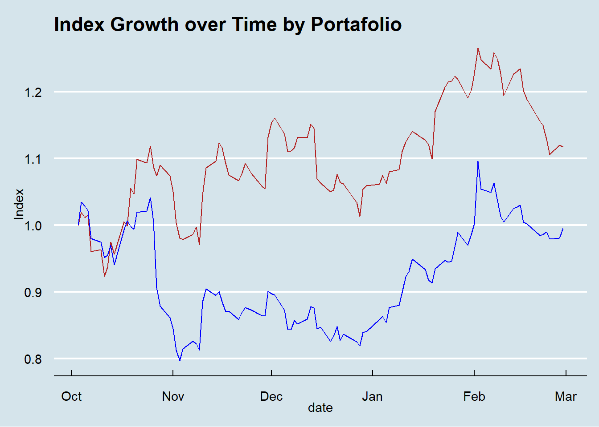

::: {.cell}

```{.r .cell-code}
library(tidyquant)
```

::: {.cell-output .cell-output-stderr}
```
Warning: package 'tidyquant' was built under R version 4.2.3
```
:::

::: {.cell-output .cell-output-stderr}
```
Loading required package: lubridate
```
:::

::: {.cell-output .cell-output-stderr}
```
Loading required package: timechange
```
:::

::: {.cell-output .cell-output-stderr}
```

Attaching package: 'lubridate'
```
:::

::: {.cell-output .cell-output-stderr}
```
The following objects are masked from 'package:base':

    date, intersect, setdiff, union
```
:::

::: {.cell-output .cell-output-stderr}
```
Loading required package: PerformanceAnalytics
```
:::

::: {.cell-output .cell-output-stderr}
```
Warning: package 'PerformanceAnalytics' was built under R version 4.2.3
```
:::

::: {.cell-output .cell-output-stderr}
```
Loading required package: xts
```
:::

::: {.cell-output .cell-output-stderr}
```
Warning: package 'xts' was built under R version 4.2.3
```
:::

::: {.cell-output .cell-output-stderr}
```
Loading required package: zoo
```
:::

::: {.cell-output .cell-output-stderr}
```
Warning: package 'zoo' was built under R version 4.2.3
```
:::

::: {.cell-output .cell-output-stderr}
```

Attaching package: 'zoo'
```
:::

::: {.cell-output .cell-output-stderr}
```
The following objects are masked from 'package:base':

    as.Date, as.Date.numeric
```
:::

::: {.cell-output .cell-output-stderr}
```

################################### WARNING ###################################
# We noticed you have dplyr installed. The dplyr lag() function breaks how    #
# base R's lag() function is supposed to work, which breaks lag(my_xts).      #
#                                                                             #
# If you call library(dplyr) later in this session, then calls to lag(my_xts) #
# that you enter or source() into this session won't work correctly.          #
#                                                                             #
# All package code is unaffected because it is protected by the R namespace   #
# mechanism.                                                                  #
#                                                                             #
# Set `options(xts.warn_dplyr_breaks_lag = FALSE)` to suppress this warning.  #
#                                                                             #
# You can use stats::lag() to make sure you're not using dplyr::lag(), or you #
# can add conflictRules('dplyr', exclude = 'lag') to your .Rprofile to stop   #
# dplyr from breaking base R's lag() function.                                #
################################### WARNING ###################################
```
:::

::: {.cell-output .cell-output-stderr}
```

Attaching package: 'PerformanceAnalytics'
```
:::

::: {.cell-output .cell-output-stderr}
```
The following object is masked from 'package:graphics':

    legend
```
:::

::: {.cell-output .cell-output-stderr}
```
Loading required package: quantmod
```
:::

::: {.cell-output .cell-output-stderr}
```
Warning: package 'quantmod' was built under R version 4.2.3
```
:::

::: {.cell-output .cell-output-stderr}
```
Loading required package: TTR
```
:::

::: {.cell-output .cell-output-stderr}
```
Warning: package 'TTR' was built under R version 4.2.3
```
:::

::: {.cell-output .cell-output-stderr}
```
Registered S3 method overwritten by 'quantmod':
  method            from
  as.zoo.data.frame zoo 
```
:::

```{.r .cell-code}
library(tidyverse)
```

::: {.cell-output .cell-output-stderr}
```
── Attaching packages
───────────────────────────────────────
tidyverse 1.3.2 ──
```
:::

::: {.cell-output .cell-output-stderr}
```
✔ ggplot2 3.4.0      ✔ purrr   1.0.0 
✔ tibble  3.1.8      ✔ dplyr   1.0.10
✔ tidyr   1.2.1      ✔ stringr 1.5.0 
✔ readr   2.1.3      ✔ forcats 0.5.2 
── Conflicts ────────────────────────────────────────── tidyverse_conflicts() ──
✖ lubridate::as.difftime() masks base::as.difftime()
✖ lubridate::date()        masks base::date()
✖ dplyr::filter()          masks stats::filter()
✖ dplyr::first()           masks xts::first()
✖ lubridate::intersect()   masks base::intersect()
✖ dplyr::lag()             masks stats::lag()
✖ dplyr::last()            masks xts::last()
✖ lubridate::setdiff()     masks base::setdiff()
✖ lubridate::union()       masks base::union()
```
:::

```{.r .cell-code}
library(rio)
library(ggplot2)
library(ggthemes)
```
:::


::: {.cell}

```{.r .cell-code}
#Create a chart to show who is winning at each day of the competition.
ggplot(me, mapping = aes(x=date, y=adjusted, group=symbol, color=symbol)) +
  geom_point() +
  geom_line()+
  labs(title = "My Stocks", y="Stock Price Adjusted") +
  theme_economist()
```

::: {.cell-output-display}
{width=672}
:::
:::

::: {.cell}

```{.r .cell-code}
#friends plot

ggplot(friend, mapping = aes(x=date, y=adjusted, group=symbol, color=symbol)) +
  geom_point() +
  geom_line()+
  labs(title = "Friend's Stocks", y="Stock Price Adjusted") +
  theme_economist()
```

::: {.cell-output-display}
{width=672}
:::
:::


::: {.cell}

```{.r .cell-code}
ggplot(both.stocks, mapping = aes(x=date, y=mean, group=buyer, color=buyer)) +
  geom_point() +
  geom_line()+
  labs(title = "Winner", y= "Stock Price Adjusted") +
  theme_economist()
```

::: {.cell-output-display}
{width=672}
:::
:::


Indexes


::: {.cell}

```{.r .cell-code}
 p2<- ggplot()+
    geom_line(port1, mapping = aes(x = date, y = portfolio.wealthindex), color= "firebrick")+ 
    geom_line(port2, mapping = aes(x = date, y = portfolio.wealthindex), color= "blue") +
  geom_point()+
  labs(y= "Index", title = "Index Growth over Time by Portafolio")+
  theme_economist() 
 

p2
```

::: {.cell-output-display}
{width=672}
:::
:::


Paragraph <br />
The first two graphs show how each person's stocks choices performed. For me the Netflix stock is helping the competition, and Meta is helping my friend. The last plot shows the indexes. Since we bot started investing the same amount of money both my line (red) and my friends(blue) start at the same point. Then each line separates as the indexes change.  
